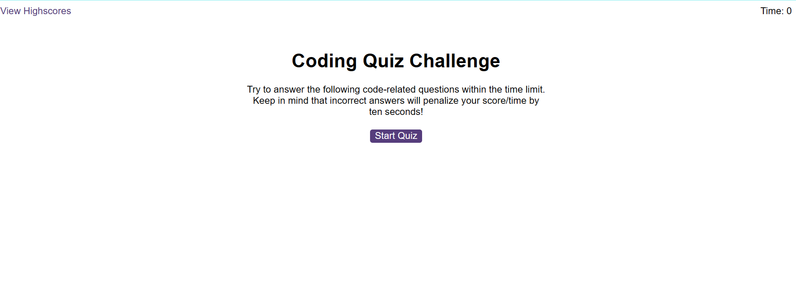

# edxbootcamp_Module6challege

# edxbootcamp_Module2challenge2


## Description

This module challege is to create a quiz on javascript.

AS A coding boot camp student
I WANT to take a timed quiz on JavaScript fundamentals that stores high scores
SO THAT I can gauge my progress compared to my peers

## Task needed to achieve this module

* GIVEN I am taking a code quiz
* WHEN I click the start button
* THEN a timer starts and I am presented with a question
* WHEN I answer a question
* THEN I am presented with another question
* WHEN I answer a question incorrectly
* THEN time is subtracted from the clock
* WHEN all questions are answered or the timer reaches 0
* THEN the game is over
* WHEN the game is over
* THEN I can save my initials and score


## Installation

N/A

## Usage 

N/A

## Output of the website

```md

```


## Link to deployed application

(https://kurresailakshmareddy.github.io/edxbootcamp_Module6challenge/)

## License

none


